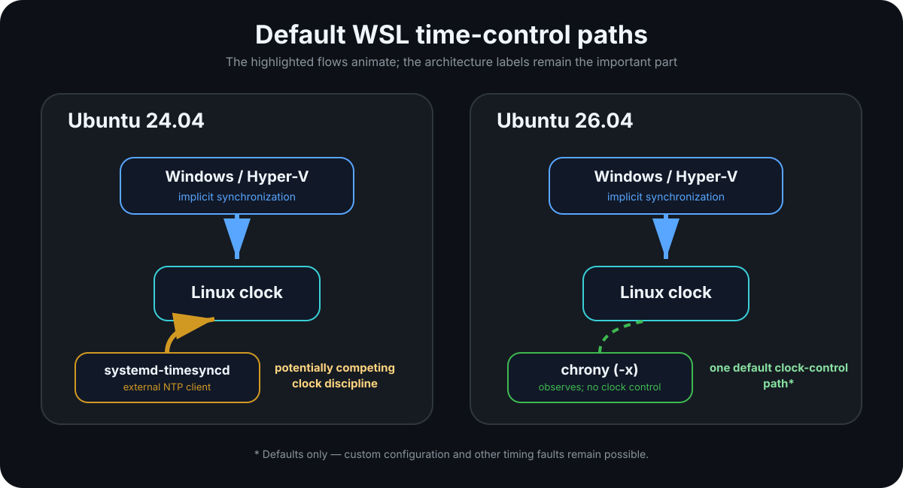
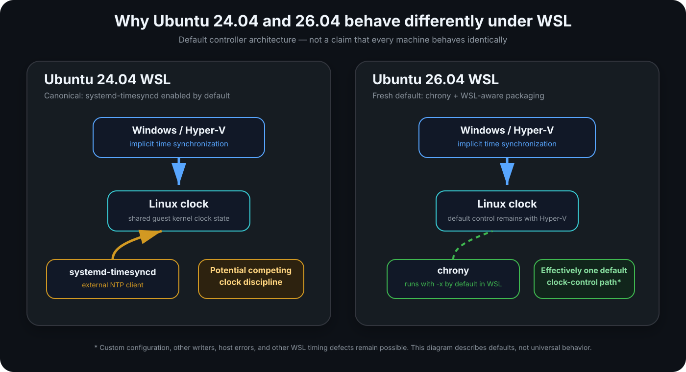
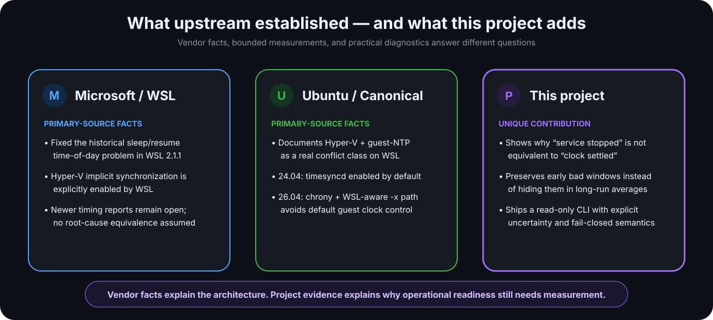
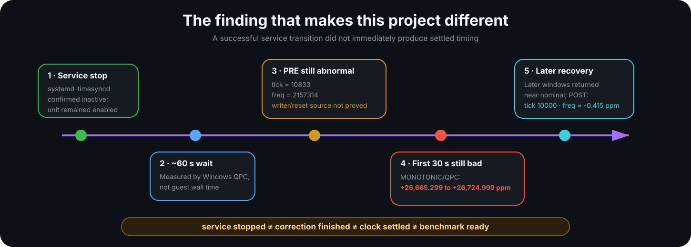

# WSL2 Timing & Ubuntu Environment Guide

<p align="center">
  
</p>

<p align="center">
  <strong>Evidence-backed WSL2 timing diagnostics, upstream research, and practical Ubuntu/Python guidance.</strong>
</p>

This project started with a timing failure serious enough to invalidate a benchmark and trigger a much deeper investigation into how WSL2, Ubuntu, Linux clock discipline, and user-space time services interact.

The result is both a **practical read-only diagnostic CLI** and a **carefully bounded engineering case study**. The goal is not to declare one distro universally “good” and another “bad.” It is to show what Microsoft and Canonical changed, what this project observed independently, and what you should measure before trusting timing-sensitive work.

> **Core lesson:** service state is not the same thing as clock-settled state.

---

## At a glance

| Question | Practical answer |
|---|---|
| **Starting a new timing-sensitive WSL project?** | A fresh **Ubuntu 26.04** installation is a strong default candidate because its WSL time-control architecture avoids the default guest-NTP competitor present in 24.04. This is not a universal timing guarantee. |
| **Need the conservative Python ecosystem baseline?** | **Python 3.12** remains a strong choice when package compatibility, reproducibility, and mature wheels matter more than using the newest interpreter. Python version does **not** fix WSL timing. |
| **Want the distro-native runtime on Ubuntu 26.04?** | **Python 3.14** is the natural default and is tested by this project. Validate your actual dependency stack. |
| **Already using Ubuntu 24.04 successfully?** | Do not migrate blindly. Inspect the active time-control configuration and run a bounded timing probe first. |
| **Stopped a time service and want to benchmark?** | Do not assume readiness. Observe the clock after the transition; a successful stop does not prove kernel correction has finished. |

---

## The architecture changed

Canonical now documents that modern WSL normally receives time synchronization from Windows/Hyper-V, while Ubuntu 24.04 and earlier also enable `systemd-timesyncd` by default. If those controllers disagree, they can compete.

Ubuntu 26.04 uses a materially different fresh-install default: chrony runs under WSL with clock control disabled by default (`-x`) unless the user explicitly opts it into changing the clock.

<p align="center">
  
</p>

**Important limits:** this is an architecture-level default, not proof that every 24.04 machine is broken or that every 26.04 machine is timing-safe. Custom configuration, other clock writers, host errors, pauses, and unrelated timing defects remain possible.

Read the sourced upstream analysis: [Upstream WSL time synchronization status](docs/upstream-time-sync-status.md).

---

## How the upstream story evolved

Microsoft fixed an important historical WSL sleep/resume time-of-day bug in the **WSL 2.1.1 prerelease** by enabling an implicit `ICTIMESYNCFLAG_SYNC` kernel path. That does **not** mean every later WSL timing problem is the same defect.

Canonical later documented the modern controller interaction directly and changed Ubuntu's default time-daemon architecture.

<p align="center">
  
</p>

The dated upstream review distinguishes:
- the historical Microsoft #10006 bug and its WSL 2.1.1 mitigation;
- later open Microsoft timing reports such as #12583 and #40745;
- Ubuntu 24.04's `systemd-timesyncd` default;
- the chrony transition beginning in Ubuntu 25.10;
- Ubuntu 26.04's WSL-aware chrony behavior;
- this project's separate bounded observations.

No public commitment or roadmap was found, as of **2026-09-24**, to retrofit the complete 26.04 time-daemon arrangement into Ubuntu 24.04.

---

## What is actually unique here?

Microsoft and Canonical provide essential upstream facts. This project adds something different: **bounded measurement of what happens around the transition**, plus tooling designed to avoid false certainty.

<p align="center">
  
</p>

### The project-specific contribution

The historical Ubuntu 24.04 investigation established that:

1. `systemd-timesyncd` was confirmed stopped while the unit remained enabled;
2. the experiment then waited about **60 seconds measured by Windows QPC**;
3. kernel timing state was still abnormal;
4. the first host-referenced 30-second timing window was still dramatically abnormal;
5. later windows returned toward nominal.

That does **not** prove `systemd-timesyncd` was the sole writer, and the source of the observed `tick=10833 → 10000` transition remains unresolved.

What it does establish is operationally important:

<p align="center">
  
</p>

> **service stopped ≠ correction finished ≠ clock settled ≠ benchmark ready**

That is the flagship lesson of this repository.

---

## Why consider Ubuntu 26.04?

For a **fresh** WSL installation, Ubuntu 26.04 has a cleaner default controller architecture for timing-sensitive work:

- Hyper-V implicit time synchronization remains enabled by WSL.
- Ubuntu uses chrony rather than `systemd-timesyncd`.
- Ubuntu's WSL startup path normally adds chrony's `-x` option, so chrony can observe/report without controlling the system clock.
- The default guest-side competitor documented for 24.04 is therefore removed.

This is one reason to **consider** Ubuntu 26.04 for new timing-sensitive WSL work.

It is not proof of universal stability. The project's own 26.04 evidence remains bounded: a 300-second guest-side screen did not show a D4R2-scale `CLOCK_MONOTONIC` versus `CLOCK_MONOTONIC_RAW` slew, but it did not establish host-relative accuracy or long-term qualification.

### Fresh install vs upgrade

An in-place upgrade from 24.04 to 26.04 does **not** by itself prove that the active time daemon changed. Ubuntu's 26.04 release notes provide explicit migration steps for upgraded systems that want to move from timesyncd to chrony.

See [Upstream WSL time synchronization status](docs/upstream-time-sync-status.md#fresh-installation-is-not-an-in-place-upgrade).

---

## Why consider Python 3.12?

Python and WSL time synchronization are separate engineering decisions.

**Python 3.12 does not fix clock behavior.** It can still be the more conservative runtime baseline when you value:

- mature wheel/package availability;
- lower dependency-migration friction;
- reproducible environments already validated on 3.12;
- compatibility with native/compiled dependencies that have not yet fully moved to 3.14.

Python 3.14 is also supported and tested by this repository. On Ubuntu 26.04 it is the natural distro-native direction.

A practical way to think about it:

| Priority | Consider |
|---|---|
| Fresh WSL timing architecture | **Ubuntu 26.04** |
| Conservative Python package baseline | **Python 3.12** |
| Distro-native Ubuntu 26.04 Python | **Python 3.14** |
| Existing proven environment | Keep it until evidence justifies migration |

Do not choose Python solely by version number. Test your real dependency set in an isolated environment.

Read more: [Python 3.12 vs Python 3.14](docs/python-3.12-vs-3.14.md).

---

## The v0.2 read-only diagnostic core

The CLI is standard-library-only at runtime and does **not** modify time services, firewall state, WSL configuration, or system Python.

### Capture environment state

```bash
wsl-time-sync diagnose --output diagnose.json
```

### Run a bounded guest-side timing probe

```bash
wsl-time-sync probe --duration 30 --cadence 1 --output probe.json
```

Schema v2 acquisition uses a RAW-bracketed sequence:

```text
CLOCK_MONOTONIC_RAW before
CLOCK_REALTIME
CLOCK_MONOTONIC
CLOCK_BOOTTIME (when available)
CLOCK_MONOTONIC_RAW after
```

The corrected v0.2 scheduler uses the first valid RAW sample as the acquisition origin, so acquisition coverage and fixed-window analysis share the same reference. `perf_counter_ns` is used only as a finite waiting guard.

### Analyze without hiding uncertainty

```bash
wsl-time-sync analyze probe.json \
  --window 10 \
  --rate-band-ppm 100 \
  --event-threshold-ns 500000000 \
  --output analysis.json
```

The analyzer reports:
- `WITHIN`, `OUTSIDE`, or `INDETERMINATE`;
- rate/ppm enclosures, not midpoint-only decisions;
- fixed windows so an early anomaly cannot disappear inside a good long-run average;
- signed adjacent REALTIME events;
- cumulative REALTIME-minus-RAW change over fixed windows;
- explicit incomplete/malformed geometry;
- legacy v0.1 support without manufacturing bounded uncertainty.

### Observe kernel state without certifying readiness

```bash
wsl-time-sync settle-check \
  --duration 30 \
  --cadence 1 \
  --required-consecutive 3 \
  --output settle.json
```

The outcomes are deliberately observational:

```text
WITHIN_CONFIGURED_BAND
ANOMALY_OBSERVED
INDETERMINATE
```

There is no unconditional `SAFE`, `READY`, or `BENCHMARK_READY` verdict.

### Compare only like-with-like reports

```bash
wsl-time-sync compare run-a.analysis.json run-b.analysis.json
```

Comparison checks schema, acquisition/reference, analysis version, thresholds, coverage, and continuity context before emitting numerical differences.

See the full [v0.2 CLI and schema reference](docs/v0.2-guest-core.md).

---

## Evidence boundaries

This repository keeps several kinds of evidence separate.

| Evidence type | What it can support |
|---|---|
| Historical project observations | What happened in the investigated environment |
| Guest-side probe | Relationships between guest clocks during that bounded capture |
| Windows-QPC historical evidence | Host-referenced timing for the preserved historical experiment |
| GitHub CI | Software correctness on the CI runners, not WSL timing qualification |
| Local WSL smoke checks | Software/runtime behavior on those specific local instances |
| Vendor documentation | Microsoft/Canonical architecture, defaults, releases, and guidance |
| Mechanism hypothesis | A reasoned explanation that remains weaker than a traced writer/root cause |

A result in one category is not automatically evidence for another.

### Current software-validation status

The runtime correction commit `dd583351` passed:
- **271 tests on CPython 3.12.14** in GitHub Actions;
- **271 tests on CPython 3.14.7** in GitHub Actions;
- strict JSON checks;
- RAW completion/coverage assertions;
- cumulative REALTIME evidence assertions;
- installed CLI smoke tests.

Reported local WSL software checks also passed on Ubuntu 24.04 / Python 3.12.3 and Ubuntu 26.04 / Python 3.14.4. Those local checks are not formal host-referenced timing qualification.

---

## What this project does **not** claim

- Ubuntu 26.04 universally fixes WSL timing.
- Ubuntu 24.04 is broken for every user.
- `systemd-timesyncd` was proven to be the sole writer or sole root cause.
- The historical C1 A–B–A intervention proved causality; its formal result remained **INCONCLUSIVE**.
- A service stop proves the kernel clock is settled.
- Guest-relative agreement proves agreement with Windows or an external clock.
- Python 3.12 or Python 3.14 changes WSL clock behavior.
- Passing CI proves a timing-sensitive benchmark is ready to run.

---

## Repository location under WSL

When working primarily from Linux tools, Microsoft recommends keeping Linux projects in the Linux filesystem, for example:

```bash
~/Projects/wsl2-time-sync-guide
```

rather than:

```text
/mnt/c/Users/<you>/...
```

See Microsoft's WSL filesystem guidance for the performance rationale.

---

## Further reading

- [Upstream WSL time synchronization status](docs/upstream-time-sync-status.md)
- [Ubuntu 24.04 findings](docs/findings-ubuntu-24.04.md)
- [Ubuntu 26.04 findings](docs/findings-ubuntu-26.04.md)
- [`systemd-timesyncd` investigation](docs/timesyncd-investigation.md)
- [Python 3.12 vs Python 3.14](docs/python-3.12-vs-3.14.md)
- [v0.2 CLI and schema reference](docs/v0.2-guest-core.md)
- [Methodology](docs/methodology.md)
- [Limitations](docs/limitations.md)
- [Real Ubuntu 26.04 WSL2 CLI smoke test](docs/real-wsl-smoke-test.md)

---

## Project philosophy

This project values a useful, honest result over a perfect-looking one.

A failed experiment can be valuable.  
An inconclusive causal test can be valuable.  
A promising observation can be valuable.  
An unavailable qualification can be valuable.

The important thing is to keep those categories separate — and to make the measurement method visible enough that other engineers can challenge it.
