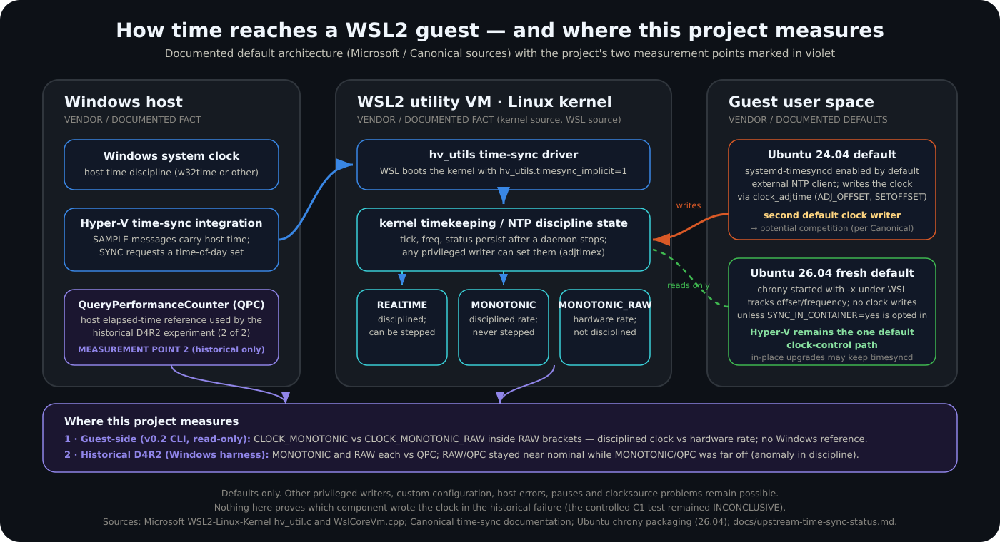
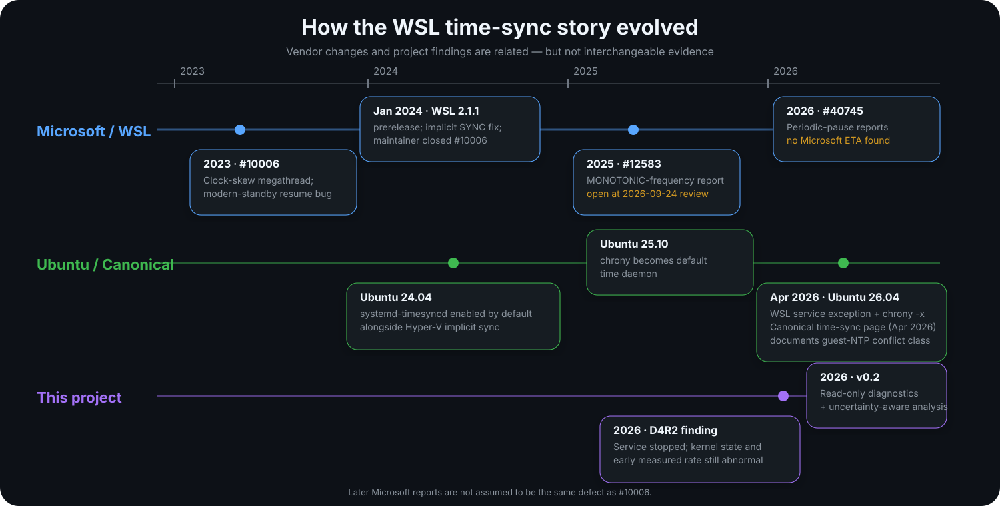

# WSL2 Time Sync Diagnostics

<p align="center">
  <a href="https://github.com/joeyn256/WSL2-Time-Sync-Diagnostics/actions/workflows/ci.yml"></a>
  
  
  
</p>

<p align="center"><strong>A read-only timing diagnostic for WSL2, and the bounded investigation that made it necessary.</strong></p>

**The problem.** A long-running benchmark under WSL2 on Ubuntu 24.04 was invalidated by clock behaviour: `CLOCK_REALTIME` was being corrected in large steps, and after the suspected user-space time service was stopped, the kernel clock was *still* running fast enough to spoil the next measurement window.

**Why it is hard.** Inside a WSL2 guest several things shape one kernel clock: the Hyper-V host integration, the guest's own NTP daemon, and the kernel's persistent discipline state (`tick`, `freq`) that outlives whichever process set it. None of them announce what they did, a service being "stopped" says nothing about corrections already in flight, and a guest cannot measure its own accuracy without an outside reference.

**What was built.** `wsl-time-sync`: a standard-library-only CLI that reads clocks inside `CLOCK_MONOTONIC_RAW` brackets, analyses fixed windows with exact interval arithmetic, reports `WITHIN` / `OUTSIDE` / `INDETERMINATE` with the uncertainty attached, and fails closed whenever a capture is incomplete. It never writes the clock, touches services, or asks for privileges.

**What the evidence showed.**

*How to read the figure:* three situations, one shared 0–120 s axis, one symmetric-log ppm scale, and every box is a committed interval enclosure. The **outer panels were measured on one Windows host on 2026-09-24** with this repository's read-only probe, each from a fresh WSL boot with one distro running: Ubuntu 24.04 with `systemd-timesyncd` active on the left, Ubuntu 26.04's fresh default on the right, both comparing `CLOCK_MONOTONIC` with `CLOCK_MONOTONIC_RAW` inside the guest. The **middle panel is the historical D4R2 run** against Windows QPC, with `t = 0` the moment its window opened, about 60 s after the confirmed stop. A summary pops up as each 30 s window closes; the chips carry the exact committed enclosures and the headline ranges are rounded outward. Red triangles under the left axis are measured `CLOCK_REALTIME` jumps. With animation off, the complete result is shown. Full record: [docs/same-host-screens-2026-09-24.md](docs/same-host-screens-2026-09-24.md).

<p align="center">
  
</p>

| Tier | Statement |
|---|---|
| **VENDOR / DOCUMENTED FACT** | Modern WSL receives time from Windows/Hyper-V. Ubuntu 24.04 also enables `systemd-timesyncd` by default, and Canonical documents that the two can disagree. A fresh Ubuntu 26.04 runs chrony with `-x` under WSL, so it does not control the clock unless opted in. |
| **PROJECT OBSERVATION** | On one Windows host on 2026-09-24, from fresh WSL boots, Ubuntu 24.04 with `systemd-timesyncd` active ran its guest clock about 4.8 % slow for 300 s with a +1.6 s `CLOCK_REALTIME` jump every 34 s and `tick` driven from 10000 to 9437, while Ubuntu 26.04's fresh default stayed within ±0.73 ppm with `tick` 10000 throughout; the host clock was 1.06 s behind NTP with the Windows Time service stopped. In the historical D4R2 run the service was confirmed stopped, the experiment waited ≈60 s (Windows QPC), and the kernel still reported `tick=10833`; the first 30 s window ran +26,665 to +26,725 ppm fast against QPC before later windows returned to within ±33 ppm. While the service was active in C1 phase A0, four REALTIME steps of about +0.59 to +0.63 s were observed. |
| **INFERENCE / INTERPRETATION** | The same-host result fits two writers with references that disagreed by about a second: timesyncd jumping to NTP time every poll and an unidentified writer slewing back toward host time at up to −83,333 ppm. The D4R2 anomaly with a near-nominal `RAW`/QPC rate points at clock *discipline*, not the hardware counter, and is consistent with a residual kernel correction outliving the daemon. Ubuntu 26.04's fresh-install defaults remove the default guest-side competitor. |
| **NOT ESTABLISHED / INCONCLUSIVE** | Which process or driver changes `tick` (9437 here, 10833 in D4R2): timesyncd's source excludes it and chrony was not running; that `systemd-timesyncd` was the sole writer (the controlled A–B–A test C1 was **INCONCLUSIVE**); whether the same-host result recurs when the host clock agrees with NTP; any 24.04-vs-26.04 ranking; host-referenced qualification of any machine. |

> **Core lesson:** service stopped ≠ correction finished ≠ clock settled ≠ benchmark ready. Measure before you trust a window.

### Try it in two minutes

```bash
python -m venv .venv && source .venv/bin/activate
python -m pip install -e .
wsl-time-sync probe --duration 30 --cadence 1 --output probe.json
wsl-time-sync analyze probe.json --window 10 --output analysis.json   # WITHIN / OUTSIDE / INDETERMINATE + intervals
wsl-time-sync diagnose --output diagnose.json                          # read-only environment + adjtimex snapshot
```

Guest-side agreement between `CLOCK_MONOTONIC` and `CLOCK_MONOTONIC_RAW` is evidence about clock discipline inside the guest; it is not accuracy against Windows or an external reference.

### Where to go next

- **Choosing an environment** → [At a glance](#at-a-glance); Ubuntu 26.04 fresh install vs 24.04, with Python 3.12 vs 3.14 kept as a separate decision.
- **How time reaches the guest** → [The architecture changed](#the-architecture-changed) and [docs/upstream-time-sync-status.md](docs/upstream-time-sync-status.md).
- **The 2026-09-24 same-host screens with committed evidence** → [docs/same-host-screens-2026-09-24.md](docs/same-host-screens-2026-09-24.md) and [evidence/2026-09-24-same-host-screens/](evidence/2026-09-24-same-host-screens/).
- **The full D4R2 record, its replay figure, and the C1 result** → [docs/timesyncd-investigation.md](docs/timesyncd-investigation.md).
- **CLI and JSON schema** → [docs/cli-schema.md](docs/cli-schema.md); **arithmetic** → [docs/methodology.md](docs/methodology.md); **limits** → [docs/limitations.md](docs/limitations.md).

---

## At a glance

| Question | Practical answer |
|---|---|
| **Starting a new timing-sensitive WSL project?** | A fresh **Ubuntu 26.04** installation is a strong default candidate because its WSL time-control architecture avoids the default guest-NTP competitor present in 24.04. This is not a universal timing guarantee. |
| **Need the conservative Python ecosystem baseline?** | **Python 3.12** remains a strong choice when package compatibility, reproducibility, and mature wheels matter more than using the newest interpreter. Python version does **not** fix WSL timing. |
| **Want the distro-native runtime on Ubuntu 26.04?** | **Python 3.14** is the natural default and is tested by this project. Validate your actual dependency stack. |
| **Already using Ubuntu 24.04 successfully?** | Do not migrate blindly. Inspect the active time-control configuration and run a bounded timing probe first. |
| **Stopped a time service and want to benchmark?** | Do not assume readiness. Observe the clock after the transition; a successful stop does not prove kernel correction has finished. |

---

## The architecture changed

Canonical now documents that modern WSL normally receives time synchronization from Windows/Hyper-V, while Ubuntu 24.04 and earlier also enable `systemd-timesyncd` by default. If those controllers disagree, they can compete.

Ubuntu 26.04 uses a materially different fresh-install default: chrony runs under WSL with clock control disabled by default (`-x`) unless the user explicitly opts it into changing the clock.

<p align="center">
  
</p>

**Important limits:** this is an architecture-level default, not proof that every 24.04 machine is broken or that every 26.04 machine is timing-safe. Custom configuration, other clock writers, host errors, pauses, and unrelated timing defects remain possible.

Read the sourced upstream analysis: [Upstream WSL time synchronization status](docs/upstream-time-sync-status.md).

---

## The read-only diagnostic core

The CLI is standard-library-only at runtime and does **not** modify time services, firewall state, WSL configuration, or system Python. **v0.6.0 is the current public pre-1.0 release of the read-only CLI, schema-v2 report format, measured comparison evidence, and documented fail-closed analysis behavior. The stable v1 contract remains deferred.**

### Install

```bash
python -m venv .venv
source .venv/bin/activate
python -m pip install -e .
```

Python 3.12 or newer; no runtime dependencies. Add `".[dev]"` to get `pytest`.

### Capture environment state

```bash
wsl-time-sync diagnose --output diagnose.json
```

### Run a bounded guest-side timing probe

```bash
wsl-time-sync probe --duration 30 --cadence 1 --output probe.json
```

Schema v2 acquisition uses a RAW-bracketed sequence:

```text
CLOCK_MONOTONIC_RAW before
CLOCK_REALTIME
CLOCK_MONOTONIC
CLOCK_BOOTTIME (when available)
CLOCK_MONOTONIC_RAW after
```

The current scheduler uses the first valid RAW sample as the acquisition origin, so acquisition coverage and fixed-window analysis share the same reference. `perf_counter_ns` is used only as a finite waiting guard.

### Analyze without hiding uncertainty

```bash
wsl-time-sync analyze probe.json \
  --window 10 \
  --rate-band-ppm 100 \
  --event-threshold-ns 500000000 \
  --output analysis.json
```

The analyzer reports:
- `WITHIN`, `OUTSIDE`, or `INDETERMINATE`;
- rate/ppm enclosures, not midpoint-only decisions;
- fixed windows so an early anomaly cannot disappear inside a good long-run average;
- signed adjacent REALTIME events;
- cumulative REALTIME-minus-RAW change over fixed windows;
- explicit incomplete/malformed geometry;
- legacy v0.1 support without manufacturing bounded uncertainty.

The bands above are example settings, not definitions of clock health; choose settings for your question and keep them with the result.

### Observe kernel state without certifying readiness

```bash
wsl-time-sync settle-check \
  --duration 30 \
  --cadence 1 \
  --required-consecutive 3 \
  --output settle.json
```

The outcomes are deliberately observational:

```text
WITHIN_CONFIGURED_BAND
ANOMALY_OBSERVED
INDETERMINATE
```

There is no unconditional `SAFE`, `READY`, or `BENCHMARK_READY` verdict.

### Compare only like-with-like reports

```bash
wsl-time-sync compare run-a.analysis.json run-b.analysis.json
```

Comparison checks schema, acquisition/reference, analysis version, thresholds, coverage, and continuity context before emitting numerical differences.

`wsl-time-sync python-check --requirements requirements.txt` reports the interpreter and whether named distributions are installed; it installs nothing.

See the full [CLI and schema reference](docs/cli-schema.md). Keep original measurements private; before sharing output, remove usernames, hostnames, personal paths, and literal boot or machine identifiers from a separate copy.

---

## Why consider Ubuntu 26.04?

For a **fresh** WSL installation, Ubuntu 26.04 has a cleaner default controller architecture for timing-sensitive work:

- Hyper-V implicit time synchronization remains enabled by WSL.
- Ubuntu uses chrony rather than `systemd-timesyncd`.
- Ubuntu's WSL startup path normally adds chrony's `-x` option, so chrony can observe/report without controlling the system clock.
- The default guest-side competitor documented for 24.04 is therefore removed.

This is one reason to **consider** Ubuntu 26.04 for new timing-sensitive WSL work.

It is not proof of universal stability. The project's own 26.04 evidence remains bounded: a 300-second guest-side screen did not show a D4R2-scale `CLOCK_MONOTONIC` versus `CLOCK_MONOTONIC_RAW` slew, but it did not establish host-relative accuracy or long-term qualification.

### Fresh install vs upgrade

An in-place upgrade from 24.04 to 26.04 does **not** by itself prove that the active time daemon changed. Ubuntu's 26.04 release notes provide explicit migration steps for upgraded systems that want to move from timesyncd to chrony.

See [Upstream WSL time synchronization status](docs/upstream-time-sync-status.md#fresh-installation-is-not-an-in-place-upgrade).

---

## Why consider Python 3.12?

Python and WSL time synchronization are separate engineering decisions.

**Python 3.12 does not fix clock behavior.** It can still be the more conservative runtime baseline when you value:

- mature wheel/package availability;
- lower dependency-migration friction;
- reproducible environments already validated on 3.12;
- compatibility with native/compiled dependencies that have not yet fully moved to 3.14.

Python 3.14 is also supported and tested by this repository. On Ubuntu 26.04 it is the natural distro-native direction.

A practical way to think about it:

| Priority | Consider |
|---|---|
| Fresh WSL timing architecture | **Ubuntu 26.04** |
| Conservative Python package baseline | **Python 3.12** |
| Distro-native Ubuntu 26.04 Python | **Python 3.14** |
| Existing proven environment | Keep it until evidence justifies migration |

Do not choose Python solely by version number. Test your real dependency set in an isolated environment.

Read more: [Python 3.12 vs Python 3.14](docs/python-3.12-vs-3.14.md).

---

## What is actually unique here?

Microsoft and Canonical provide essential upstream facts. This project adds something different: **bounded measurement of what happens around the transition**, plus tooling designed to avoid false certainty.

### The project-specific contribution

The historical Ubuntu 24.04 investigation established that:

1. `systemd-timesyncd` was confirmed stopped while the unit remained enabled;
2. the experiment then waited about **60 seconds measured by Windows QPC**;
3. kernel timing state was still abnormal;
4. the first host-referenced 30-second timing window was still dramatically abnormal;
5. later windows returned toward nominal.

That does **not** prove `systemd-timesyncd` was the sole writer, and the source of the observed `tick=10833 → 10000` transition remains unresolved.

The figure below puts the same record next to the question it answers: who can write the clock in each situation, and what the kernel's own `tick` state looked like before and after the measured run.

<p align="center">
  
</p>

What it does establish is operationally important:

> **service stopped ≠ correction finished ≠ clock settled ≠ benchmark ready**

That is the flagship lesson of this repository. A step-by-step replay of the same record accompanies the full table in [docs/timesyncd-investigation.md](docs/timesyncd-investigation.md).

---

## How the upstream story evolved

Microsoft closed the historical WSL sleep/resume time-of-day bug (#10006) with the **WSL 2.1.1 prerelease**, which enabled an implicit `ICTIMESYNCFLAG_SYNC` kernel path and was described as solving that issue. That does **not** mean every later WSL timing problem is the same defect.

Canonical later documented the modern controller interaction directly and changed Ubuntu's default time-daemon architecture.

<p align="center">
  
</p>

The dated upstream review distinguishes:
- the historical Microsoft #10006 bug and its WSL 2.1.1 mitigation;
- later open Microsoft timing reports such as #12583 and #40745;
- Ubuntu 24.04's `systemd-timesyncd` default;
- the chrony transition beginning in Ubuntu 25.10;
- Ubuntu 26.04's WSL-aware chrony behavior;
- this project's separate bounded observations.

No public commitment or roadmap was found, as of **2026-09-24**, to retrofit the complete 26.04 time-daemon arrangement into Ubuntu 24.04.

---

## Evidence boundaries

This repository keeps several kinds of evidence separate.

| Evidence type | What it can support |
|---|---|
| Historical project observations | What happened in the investigated environment |
| Committed same-host screens (2026-09-24) | Guest-clock behaviour on one host from fresh boots, with raw JSON in `evidence/`; not host-referenced |
| Guest-side probe | Relationships between guest clocks during that bounded capture |
| Windows-QPC historical evidence | Host-referenced timing for the preserved historical experiment |
| GitHub CI | Software correctness on the CI runners, not WSL timing qualification |
| Local WSL smoke checks | Software/runtime behavior on those specific local instances |
| Vendor documentation | Microsoft/Canonical architecture, defaults, releases, and guidance |
| Mechanism hypothesis | A reasoned explanation that remains weaker than a traced writer/root cause |

A result in one category is not automatically evidence for another.

### Current software-validation status

The v0.6.0 release uses the same strict software-quality gate planned for the future stable v1 release on **both Python 3.12 and Python 3.14**:

- the complete **271-test** suite;
- construction and installation of the normal `wsl2-time-sync-diagnostics` wheel, with distribution and import version checks;
- the semantic CLI smoke: strict JSON, verified RAW acquisition completion and requested-duration coverage, two complete fixed windows with zero partial windows, cumulative REALTIME evidence, and method-aware comparison.

Every v0.6.0 release candidate must pass these gates at the exact release commit before `main` advances and the tag is created. The package remains semantically pre-1.0, and the stable v1.0.0 contract is intentionally deferred. Use the CI badge and the checks attached to the current/tagged commit for live status. Historical implementation and adversarial-review runs are retained in [RELEASE_MANIFEST.json](RELEASE_MANIFEST.json).

Local WSL software checks were also performed during review on Ubuntu 24.04 / Python 3.12.3 and Ubuntu 26.04 / Python 3.14.4. Those checks are software-validation evidence only; they are not host-referenced timing qualification, which remains unavailable.

---

## What this project does **not** claim

- Ubuntu 26.04 universally fixes WSL timing.
- Ubuntu 24.04 is broken for every user.
- `systemd-timesyncd` was proven to be the sole writer or sole root cause.
- That the historical C1 A–B–A intervention proved causality; its formal result remained **INCONCLUSIVE**.
- A service stop proves the kernel clock is settled.
- Guest-relative agreement proves agreement with Windows or an external clock.
- Python 3.12 or Python 3.14 changes WSL clock behavior.
- Passing CI proves a timing-sensitive benchmark is ready to run.

---

## Repository location under WSL

When working primarily from Linux tools, Microsoft recommends keeping Linux projects in the Linux filesystem, for example:

```bash
~/Projects/WSL2-Time-Sync-Diagnostics
```

rather than:

```text
/mnt/c/Users/<you>/...
```

See [Microsoft's WSL filesystem guidance](https://learn.microsoft.com/windows/wsl/filesystems#file-storage-and-performance-across-file-systems) for the performance rationale.

---

## Further reading

- [Upstream WSL time synchronization status](docs/upstream-time-sync-status.md)
- [Ubuntu 24.04 findings](docs/findings-ubuntu-24.04.md)
- [Ubuntu 26.04 findings](docs/findings-ubuntu-26.04.md)
- [`systemd-timesyncd` investigation](docs/timesyncd-investigation.md)
- [Same-host screens, 2026-09-24](docs/same-host-screens-2026-09-24.md)
- [Python 3.12 vs Python 3.14](docs/python-3.12-vs-3.14.md)
- [CLI and schema reference](docs/cli-schema.md)
- [Methodology](docs/methodology.md)
- [Limitations](docs/limitations.md)
- [Real Ubuntu 26.04 WSL2 CLI smoke test](docs/real-wsl-smoke-test.md)

---

## Project philosophy

This project values a useful, honest result over a perfect-looking one.

A failed experiment can be valuable.  
An inconclusive causal test can be valuable.  
A promising observation can be valuable.  
An unavailable qualification can be valuable.

The important thing is to keep those categories separate, and to make the measurement method visible enough that other engineers can challenge it.
